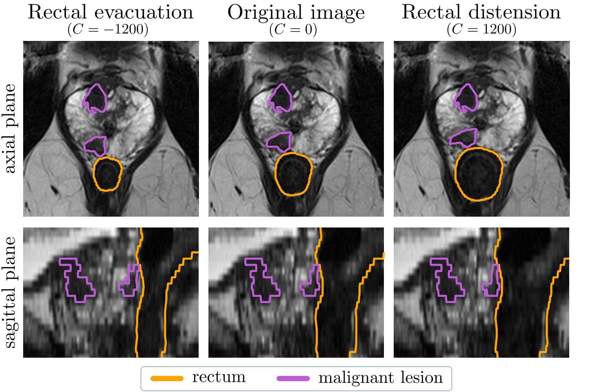
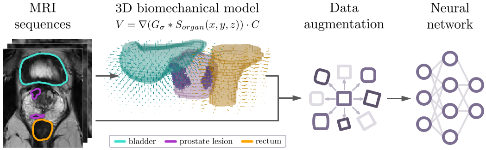

# Anatomy-informed Augmentation


The data augmentation is presented on MICCAI 2023 in the proceedings of
'Anatomy-informed Data Augmentation for enhanced Prostate Cancer Detection'.

If you use this augmentation please cite the following work:
```
Kovacs, Balint, et al. "Anatomy-Informed Data Augmentation for Enhanced Prostate Cancer Detection."
International Conference on Medical Image Computing and Computer-Assisted Intervention.
Cham: Springer Nature Switzerland, 2023.
```

## Usage


To use the anatomy-informed augmentation during network training, your segmentation files need additional
organ segmentations. In this current example, we add the rectum and bladder segmentations additionally to the
prostate cancer segmentations (not all organ segmentations are necessary, it can also be used individually).
In that case, your `dataset.json` and `segmentation files` should contain the
following labels:
```
...
"labels": {
    "background": "0",
    "malignant prostate lesion": "1",
    "rectum": "2",
    "bladder": "3" 
},...
```

The nnU-Net trainer `nnUNetTrainer_AnatInf.py` is the version for the training utilizing the anatomy-informed
augmentation. During training the rectum and the bladder are realistically deformed to provide diverse organ &
lesion morphologies resulted from physiological soft tissue deformations. There are only 2 modifications in the trainer:
1) `tr_transforms` is appended with the `AnatomyInformedTransform` transformation with the following parameters:
   - `dil_ranges`: dilation range per organs
   - `modalities`: on which input channels should the transformation be applied
   - `directions_of_trans`: to which directions should the organs be dilated per organs
   - `p_per_sample`: probability of the transformation per organs
   - `spacing_ratio`: ratio of the transversal plane spacing and the slice thickness, in our case it was 0.3125/3
   - `blur`: Gaussian kernel parameter, we used the value 32 for 0.3125mm transversal plane spacing
   - `anisotropy_safety`: it provides a certain protection against transformation artifacts in 2 slices from the image border
   - `max_annotation_value`: the value that should be still relevant for the main task
   - `replace_value`: segmentation values larger than the `max_annotation_value` will be replaced with
2) `val_transforms` is appended with the `IgnoreAnatomy` transformation with the following parameters:
   - `max_annotation_value`: the value that should be still relevant for the main task
   - `replace_value`: segmentation values larger than the `max_annotation_value` will be replaced with

**Important suggestions for its successful utilization:**
* If you use this augmentation for multi-modal images/across multiple channels, please make sure that the modalities
are well aligned/co-registered otherwise the transformation will not be realistic for all the image modalities.
* By deriving the equation required for the transformation, we made simplifications in the biomechanical properties of
the human pelvis. Using large amplitudes can lead to unrealistic transformations. Try first to use moderate amplitudes
and always inspect the results visually too.
* Although the calculation of the transformation allows certain errors in the additional organ segmentations,
it is worth to use proper organ segmentations

Furthermore, the additional organ labels of the class variable `_all_labels` of the `PlansManager` class in
`utilities/plans_handling/plans_handler.py` are also removed to reduce the number of output channels of the network.
```
label_manager_instance._all_labels = label_manager_instance._all_labels[:2]
```

## Installation
The repository is forked from nnU-Net v2, but contains no pretrained network so it can be used as an integrative
framework for model developement
1) Create a new conda new conda environment with the recent version of Python (nnU-Net v2 supports 3.9 or newer version),
as an example: `conda create --name nnUNet_AnatInf python=3.9`
2) Install pytorch with the most recent CUDA version by following the instructions on the
[PyTorch Website](https://pytorch.org/get-started/locally/).
3) Clone this repository and install its dependencies:
```
https://github.com/MIC-DKFZ/anatomy_informed_DA.git
cd anatomy-informed-da
pip install -e .
```
You can find more information in the
[nnU-Net installation instructions](https://github.com/MIC-DKFZ/nnUNet/blob/master/documentation/installation_instructions.md).


## Copyright
Copyright German Cancer Research Center (DKFZ) and contributors.
Please make sure that your usage of this code is in compliance with its
[license](https://github.com/MIC-DKFZ/anatomy_informed_DA/blob/master/LICENSE).

